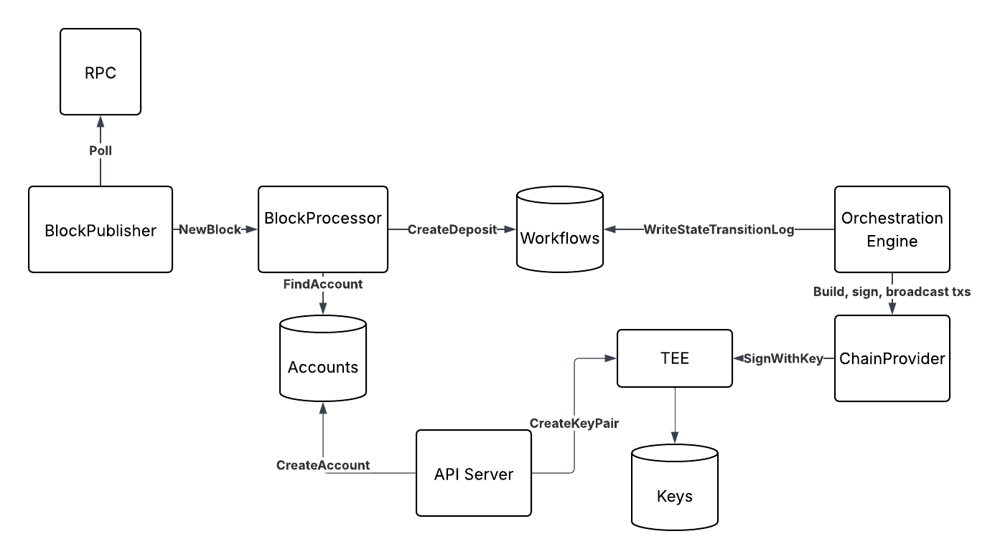
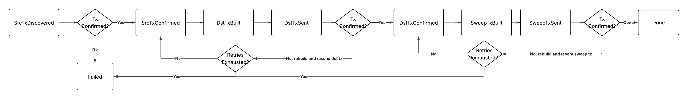
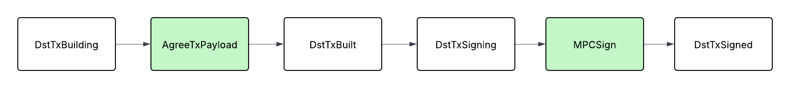

# Run locally
1. Create .env file following .env.example. This program requires a funded hot wallet in order to credit deposits. Wallet should have a USDC balance on Hyperliquid core testnet.
2. Run `make setup` to import environment's private key into local key store.
3. Start agent by running `make start`. This will start the API server, block publisher, and state machine.
5. Clean up by running `make teardown`. This will delete all persisted data (deposit addresses, workflow states, keys).

#### Deposit flow
1. Call `curl --request GET --url http://localhost:8000/gen/ethereum/hyperliquid/eth/{sourceAddress}`. This will generate a deposit address for a sepolia -> hyperliquid deposit
2. Send ETH on Sepolia to deposit address.
3. Agent detects the deposit and waits for confirmations.
3. Once the transaction has required confirmations (14), agent will credit the deposit on Hyperliquid (0.01 ETH = 10 USDC)
4. Once destination deposit ransaction is confirmed, agent submits transaction to sweep funds out of deposit address. The funds go back to the provided `HOT_WALLET_ADDRESS`.
5. On sweep transaction finalization, deposit workflow is marked as done.

# Design
### Major components
#### API
Hosts endpoint for address generation with idempotency checks to prevent duplicate account generation. Creates new deposit addresses and stores in an account DB.

#### BlockPublisher
Polls and publishes new blocks. In production system, pulls out and publishes transfer events.

#### StateMachine
Responsible for durably orchestrating deposit/withdrawal workflows. Backoff/retry logic for handling errors, ensures transactions are not submitted twice by freezing nonce. Persists workflow state for graceful recovery, in production system use an append only event log.
The block processor also lives in this file and is responsible for listening to new blocks and identifying any transfers matching known deposit addresses. For each found transfer, enqueue a new deposit workflow execution.

#### ChainProvider
Builds transaction payloads, signs and broadcasts transactions.

### DevOps deployment plan
-	Separate service deployments for API, block publisher, state machine, chain provider, each service runs on containerized EC2 instances. This enables independent scaling of each component and strict access control.
- All private key access and signing operations are strictly confined to TEE instances.
-	Blue/green deploys with health checks and automatic failover.
-	Shared VPC with restricted ingress, only API server accepts external requests.
- Load balance RPC requests across multiple providers

### Limitations
- Local keystore for private key management. In production use AWS KMS or similar.
- The block publisher does not persist its last seen block. This means if the service is stopped and restarted, we will only start again from the current head. To address this we can introduce periodic checkpointing to recover gracefully.
- To persist workflow state, I elected to store a simple state object that gets mutated on transitions. In a production environment I would introduce an append only log instead to ensure auditability and replayability.
- The state machine processes deposits one by one and does so by scanning the entire state DB. This is inefficient and won't scale, instead we should rely on a proper index or introduce a job queue
- Everything runs in a single process for demo purposes, database (bolt) just persists files locally.

### Diagram 

State diagram (as implemented)

### Error and failure handling
- State machine goes down -> recover from append only state transition event log. Write "intent" states before committing to an action. All state transitions are designed to be idempotent - for example before broadcasting a transaction, store its hash and ensure hash was not already submitted.
- Block publisher crashes handled with checkpointing system. Idempotent downstream consumer means we can safely replay blocks if needed.
- Transactions can revert, the state machine has transaction retry flows. This will reset the state machine back to transaction building steps.
- External dependencies can go down - namely RPC providers and APIs like Hyperliquid's API. Our workflow execution engine implements retries and expontential backoff+jitter to handle these failures. We can introduce a reconciliation service to run periodically for failed workflows.
- Transactions may be reorged. State machine has steps to wait for a configurable number of confirmations before continuing other actions. Tradeoff is deposits may take a while, but our options are limited here. If we don't wait for finalization, there's a small possibility that the user's initial deposit in the deposit address gets reorged out on one chain, but we've already credited the destination account and can no longer sweep funds out of the deposit address.

### Implementing consensus
Introduce a consensus layer to the system. A new consensus service will be responsible for broadcasting proposed actions to other network participants, accepting and validating inbound proposals, and synchronizing state. Introduce additional states to the state machine for consensus gathering actions, and write "intent" events prior to committing for greater auditability and recoverability.

- All actions taken will be proposed to other participants first.
- Participants agree on transaction calldata before signing.
- Replace single-node signing with MPC. Keys are never reconstructed on one host.
- Ensures consistent state transitions across participants.
- Encrypt communication between participants.

### Chain and asset support
- Separate block publisher deployments per chain for isolation, independent scaling, and tolerating chain specific failures/regressions (RPC provider outages, network congestion, reorgs, etc.)
- Modular, chain agnostic code for core functionalities. Adapters for generating calldata, broadcasting transactions, etc.

### Security and security posture
Security model is built on core principles of isolation, least privilege, and auditable operations.

- Signing actions and key access are limited to TEEs. Key shares are generated within secure enclaves. No single node can reconstruct entire key. Key share access can require attestation so only a specific image may access it.
- Frozen transaction nonces to prevent replay attacks, transaction payloads are agreed upon by participants prior to signing.
- State transitions written in an append only log for auditability.
- Service components are deployed with minimal privileges; for example, the API server cannot sign transactions or access sensitive key material

#### Dev processes
- Role based access control (RBAC) for interacting with cloud resources. Admin priveleges are on a per grant basis and actions are logged and monitored. Alerting set up on production resources. Limits blast radius of social engineering/phishing attacks.
- Validate external dependencies. Run vulnerability checks in CI/CD. We have tools to detect tampering, but ultimately we cannot prevent social engineering attacks like what happend with npm recently, we should assume that this will happen eventually. Minimizing external package usage and generally perferring standard Go libraries reduces our risk here.
- Regular penetration testing.

#### How would you attack Unit's current system?
- Endpoints take 2-3+ seconds to respond and there doesn't seem to be any caching on endpoints like estimate-fees. I would attempt overload the system with repeated calls to these endpoints to try to build up open connections and potentially exhaust resources within the service. For example, create millions of deposit addresses. This will likely only disrupt or halt the service.
- Similarly, attempt to overload individual agents with requests to potentially create a window of opportunity for bad actors in the network to gain a majority vote.
- Phishing/social engineering given small team size, only 3 guardians.

Minor
- Unit testnet deployment's Privy app reached maximum accounts and users cannot connect a new wallet. It seems that each wallet connection creates a Privy user. Since Privy charges based on MAUs an attacker can run up your bill.
- Datadog API key is exposed, I would use it to run up the bill.
